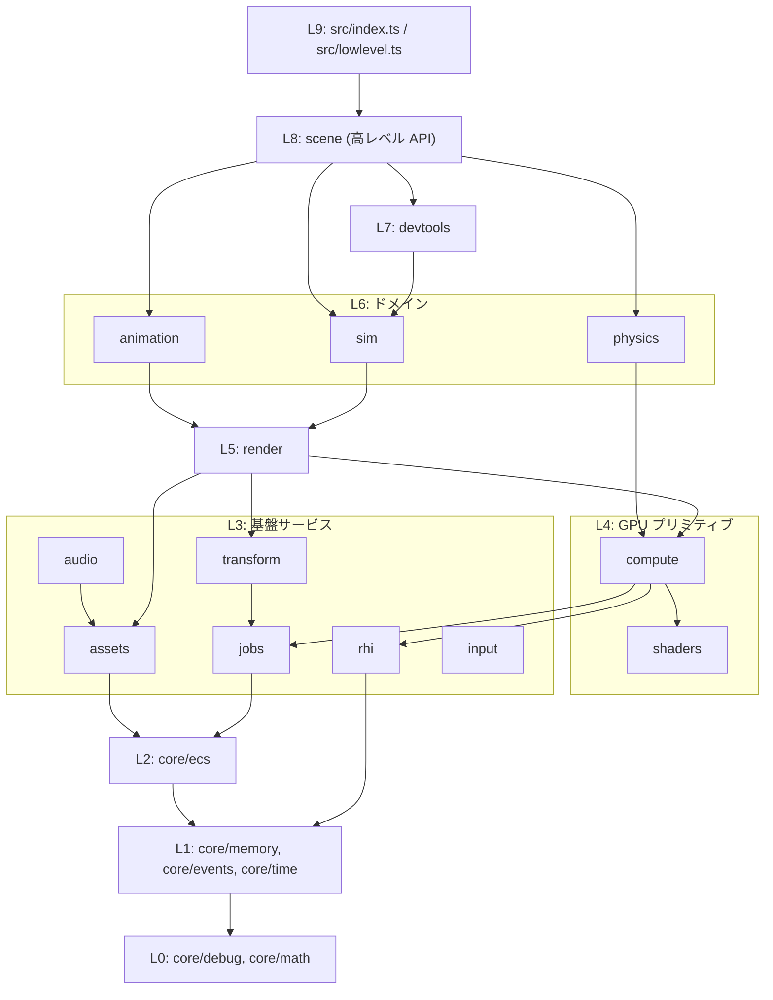
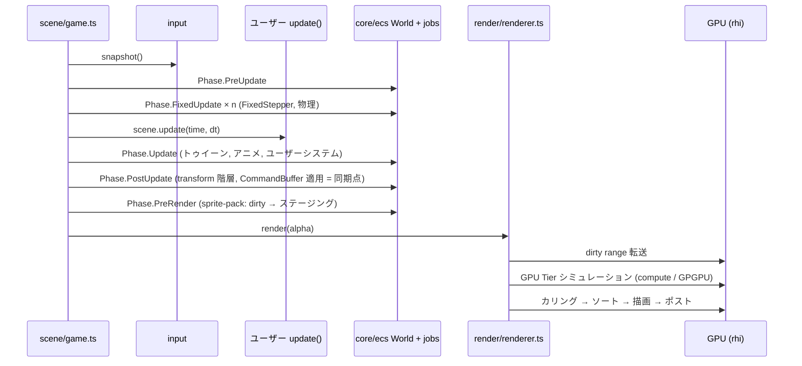

# 01. アーキテクチャ

## 1. レイヤー図

下位レイヤーは上位レイヤーを **知らない**。矢印は「import してよい」方向。
正確な許可表は `.agents/rules/03-architecture.md` (機械検査: `tools/check-boundaries.mjs`)。

## 2. 各モジュールの責務 (1 行で)

| モジュール    | 責務                                                   | 持ってはいけないもの                        |
| ------------- | ------------------------------------------------------ | ------------------------------------------- |
| `core/debug`  | assert, エラー, ログ                                   | 他すべて                                    |
| `core/math`   | 割り当てなし数学関数                                   | クラス、状態                                |
| `core/memory` | バッファ確保, ビットセット, アロケータ                 | ECS の知識                                  |
| `core/events` | 型安全イベント                                         | DOM の知識                                  |
| `core/time`   | 時計, 固定ステップ                                     | フレームループ本体 (それは `scene/game.ts`) |
| `core/ecs`    | SoA ECS (World, Query, System)                         | ゲーム固有コンポーネント (Transform 等)     |
| `jobs`        | チャンク並列実行                                       | ゲーム知識、GPU                             |
| `rhi`         | GPU API の抽象化                                       | スプライト等の描画知識                      |
| `assets`      | ファイル → CPU データ                                  | GPU アップロード (それは `render`)          |
| `input`       | DOM 入力 → フレームスナップショット                    | ゲームロジック                              |
| `audio`       | WebAudio 再生                                          |                                             |
| `transform`   | Transform 系コンポーネントと階層計算                   | 描画                                        |
| `shaders`     | シェーダ文字列の管理                                   | TS ロジック (前処理以外)                    |
| `compute`     | GPU 汎用アルゴリズム (scan, sort, 空間ハッシュ)        | スプライト知識                              |
| `render`      | スプライト・テキスト等の描画、カメラ、レンダーグラフ   | シミュレーション                            |
| `sim`         | GPU Tier のシミュレーション (パーティクル・群衆・流体) | 高レベル API                                |
| `physics`     | アーケード物理・剛体物理                               | 描画                                        |
| `animation`   | トゥイーン・フレームアニメ                             |                                             |
| `devtools`    | 計測・表示                                             | ゲーム機能                                  |
| `scene`       | 高レベル API (Game, Scene, add.*, ハンドル)            | ホットパスのロジック (下位に委譲する)       |

## 3. 1 フレームのデータフロー

## 4. フェーズ (`Phase` 定数、`src/core/ecs/system.ts`)

| 値  | 名前          | 内容                                                  |
| --- | ------------- | ----------------------------------------------------- |
| 0   | `PreUpdate`   | 入力反映、タイマー                                    |
| 1   | `FixedUpdate` | 物理 (固定ステップ、1 フレームに 0〜`maxSubSteps` 回) |
| 2   | `Update`      | トゥイーン、アニメーション、ユーザーシステム          |
| 3   | `PostUpdate`  | Transform 階層計算、CommandBuffer 適用                |
| 4   | `PreRender`   | スプライトパック、カメラ uniform 更新                 |

描画そのものはシステムではなく `Renderer.render()` が行う。

## 5. 描画パスの選択

`RhiCapabilities.compute` が `true` → `sprite-path-gpu-driven.ts`、`false` → `sprite-path-cpu-assisted.ts`。
選択は `sprite-renderer.ts` の初期化時に 1 回だけ行う。フレーム中に `if (webgpu)` のような分岐を散らばらせてはならない。
